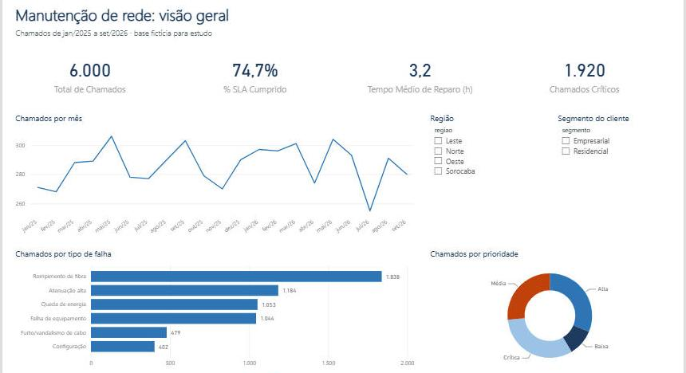
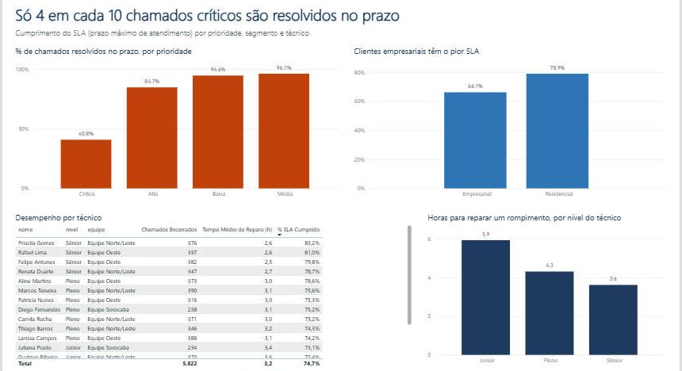
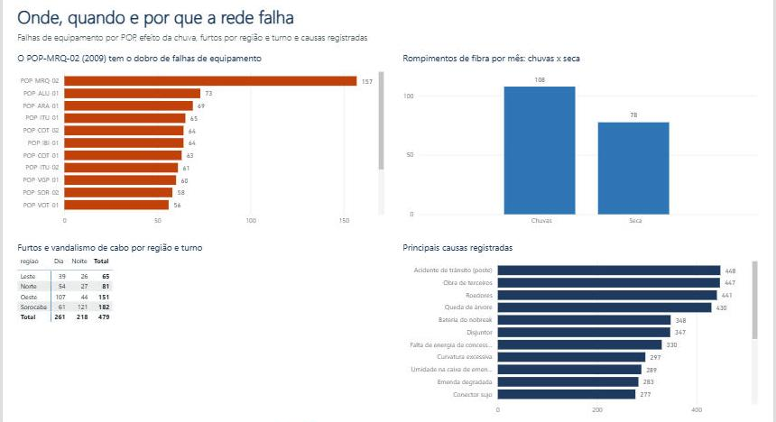

# 📊 Dashboard de Manutenção de Rede no Power BI

Dashboard em **Power BI** para a gestão de manutenção de uma rede de fibra óptica: volume de chamados, cumprimento do SLA, desempenho dos técnicos e as causas das falhas, em 3 páginas interativas.




---

## 📌 Contexto

Este dashboard usa a mesma base de **6.000 chamados de manutenção** analisada com SQL no projeto [analise-chamados-sql](https://github.com/AlessandroMaxv10/analise-chamados-sql). Lá, as perguntas foram respondidas com consultas; aqui, as respostas viram um painel que um gestor de operações consegue usar no dia a dia.

> A base é **fictícia**, criada para estudo a partir de situações reais de manutenção de redes de fibra óptica, área em que trabalhei por mais de 12 anos.

## 🧱 O que foi construído

### Tratamento dos dados (Power Query)
- Importação dos 4 arquivos CSV (chamados, clientes, POPs e técnicos)
- Correção de tipos de falha digitados de forma inconsistente
- Causas não preenchidas marcadas como "Não informada"
- Colunas calculadas: tempo total de atendimento, tempo de reparo, **cumprimento do SLA** e **turno** (dia ou noite)

### Modelo de dados (esquema estrela)
```
            clientes        pops        tecnicos
                 \           |           /
                  \          |          /
                   ───── chamados ─────
                             |
                        Calendario
```
A tabela de fatos (`chamados`) fica no centro, ligada às dimensões de cliente, POP, técnico e a uma **tabela calendário** criada em DAX.

### Medidas DAX
| Medida | O que calcula |
|---|---|
| `Total de Chamados` | Quantidade de chamados |
| `% SLA Cumprido` | Chamados resolvidos dentro do prazo ÷ chamados encerrados |
| `Tempo Médio de Reparo (h)` | Média de horas entre o início do atendimento e o encerramento |
| `Chamados Críticos` | Chamados de prioridade crítica |
| `Falhas de Equipamento` | Chamados de falha de equipamento |
| `Furtos e Vandalismo` | Chamados de furto ou vandalismo de cabo |
| `Rompimentos por Mês` | Média mensal de rompimentos de fibra |
| `Tempo Reparo Rompimento (h)` | Tempo médio de reparo só dos rompimentos |

## 📄 As 3 páginas

### 1. Visão geral
Indicadores principais, evolução mensal, chamados por tipo de falha e por prioridade, com filtros de região e segmento de cliente.

### 2. SLA e atendimento


- Só **40,8%** dos chamados críticos são resolvidos dentro do SLA de 4 horas
- Clientes **empresariais** têm SLA de **66,1%**, contra 78,9% dos residenciais
- Técnicos júniores levam **5,9 horas** para reparar um rompimento, contra 3,6 dos sêniores

### 3. Rede e causas


- O **POP-MRQ-02**, instalado em 2009, tem **157** falhas de equipamento, mais que o dobro de qualquer outro POP
- Na época de chuvas, a média sobe de **78 para 108 rompimentos por mês**
- **Sorocaba à noite** concentra o maior número de furtos e vandalismo de cabo

## 📁 Estrutura

O dashboard está salvo no formato de **projeto do Power BI (`.pbip`)**, em arquivos de texto que o Git consegue versionar:

```
dashboard-chamados-powerbi/
├── Dashboard_Chamados.pbip              # abra este arquivo no Power BI Desktop
├── Dashboard_Chamados.SemanticModel/    # modelo: tabelas, relacionamentos e medidas (TMDL)
├── Dashboard_Chamados.Report/           # páginas e gráficos
├── csv/                                 # dados de origem
└── imagens/                             # prints do dashboard
```

## ▶️ Como abrir

1. Instale o [Power BI Desktop](https://www.microsoft.com/pt-br/power-platform/products/power-bi/desktop) (gratuito)
2. Baixe ou clone este repositório
3. Ajuste o caminho dos arquivos CSV, se necessário: **Transformar dados → Configurações da fonte de dados**
4. Abra o `Dashboard_Chamados.pbip` e clique em **Atualizar**

## 🛠️ Tecnologias

- **Power BI Desktop**
- **Power Query (M)** para tratamento dos dados
- **DAX** para medidas e tabela calendário
- **Modelagem em esquema estrela**

---

👤 **Alessandro José dos Santos** · [LinkedIn](https://www.linkedin.com/in/alessandro-jos%C3%A9-dos-santos-01b87a127) · [Portfólio](https://alessandromaxv10.github.io)
